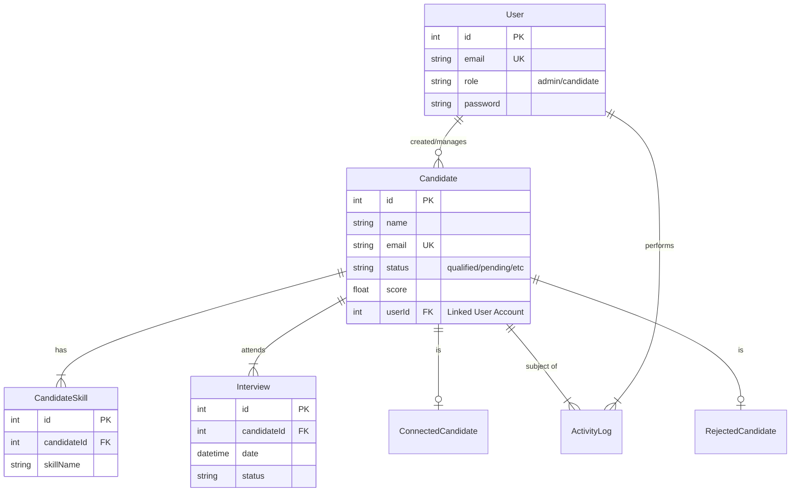

# Final Project Report: TALENTHUB Platform

**Date**: December 2025
**Project**: TALENTHUB - Premium AI Recruitment Dashboard

---

## 1. Application Description

**TALENTHUB** is a comprehensive, high-performance web application designed to modernize the recruitment lifecycle. Built to address the inefficiencies of traditional applicant tracking systems (ATS), TALENTHUB provides a visually immersive, glassmorphic interface that allows recruiters to manage candidates with speed and precision.

Key capabilities include:
-   **Centralized Recruitment Hub**: A unified dashboard for tracking application statuses, interview schedules, and hiring metrics.
-   **Role-Based Access Control (RBAC)**: Distinct, secure environments for Recruiters (Admins) and Candidates.
-   **Candidate Profiling**: Detailed candidate cards displaying skills, experience, and an AI-calculated "Fit Score".
-   **Real-time Analytics**: Visual data representation using dynamic charts to monitor hiring pipeline health.
-   **Interactive Workflow**: Kanban-style status updates (Qualified, Scheduled, Rejected) with instant visual feedback.

The platform emphasizes "Premium UX," moving away from utilitarian designs to a rich, engaging, and professional aesthetic suitable for high-stakes hiring environments.

## 2. Methodology

The development of TALENTHUB followed an **Agile-Iterative** methodology, allowing for rapid prototyping and continuous refinement.

### Phases:
1.  **Requirement Analysis**: Identified key pain points in recruitment (cluttered UIs, lack of immediate insights) and defined core features (Dashboard, Candidate Management).
2.  **System Design**: Defined the database schema (Relationship entity modeling) and API architecture (RESTful routes).
3.  **Implementation**:
    -   **Frontend First**: Built the "Glass Panel" design system using Tailwind CSS to ensure visual consistency.
    -   **Backend Integration**: Developed Next.js API routes to handle CRUD operations and business logic.
    -   **Database Integration**: Utilized Prisma ORM for type-safe database interactions and schema management.
4.  **Verification & Polish**: Conducted "pente fino" (fine-tooth comb) reviews for linting errors, visual bugs, and performance optimization.

### Tech Stack:
-   **Frontend**: Next.js 15 (App Router), React, Tailwind CSS v4, Framer Motion.
-   **Backend**: Next.js Serverless Functions (API Routes).
-   **Database**: MySQL with Prisma ORM.

## 3. Database Related

The database is designed to be relational, focusing on data integrity and defined candidate workflows.

### 3.1 ER Diagram (Entity-Relationship)



### 3.2 DDL (Data Definition Language)

Below are the key SQL statements used to define the schema (generated via Prisma migration):

```sql
-- Create Users Table
CREATE TABLE `users` (
    `id` INTEGER NOT NULL AUTO_INCREMENT,
    `email` VARCHAR(191) NOT NULL,
    `name` VARCHAR(191) NOT NULL,
    `password` VARCHAR(191) NOT NULL,
    `role` VARCHAR(191) NOT NULL DEFAULT 'recruiter',
    `createdAt` DATETIME(3) NOT NULL DEFAULT CURRENT_TIMESTAMP(3),
    PRIMARY KEY (`id`),
    UNIQUE INDEX `users_email_key`(`email`)
);

-- Create Candidates Table
CREATE TABLE `candidates` (
    `id` INTEGER NOT NULL AUTO_INCREMENT,
    `name` VARCHAR(191) NOT NULL,
    `email` VARCHAR(191) NOT NULL,
    `role` VARCHAR(191) NOT NULL,
    `status` VARCHAR(191) NOT NULL DEFAULT 'pending',
    `score` DOUBLE NOT NULL DEFAULT 0,
    `scoreBreakdown` JSON NULL,
    `experience` JSON NULL,
    `photoUrl` VARCHAR(191) NULL,
    `appliedDate` DATETIME(3) NOT NULL DEFAULT CURRENT_TIMESTAMP(3),
    `updatedAt` DATETIME(3) NOT NULL,
    `userId` INTEGER NULL,
    `createdById` INTEGER NULL,
    PRIMARY KEY (`id`),
    UNIQUE INDEX `candidates_email_key`(`email`)
);

-- Create Skills Table
CREATE TABLE `candidate_skills` (
    `id` INTEGER NOT NULL AUTO_INCREMENT,
    `candidateId` INTEGER NOT NULL,
    `skillName` VARCHAR(191) NOT NULL,
    PRIMARY KEY (`id`),
    UNIQUE INDEX `candidate_skills_candidateId_skillName_key`(`candidateId`, `skillName`)
);
```

### 3.3 DML (Data Manipulation Language)

Examples of queries used within the application logic:

**Insert a New Candidate:**
```sql
INSERT INTO candidates (name, email, role, status, score, appliedDate, updatedAt)
VALUES ('Jane Doe', 'jane@example.com', 'Senior Developer', 'pending', 95.5, NOW(), NOW());
```

**Update Candidate Status:**
```sql
UPDATE candidates 
SET status = 'qualified', updatedAt = NOW()
WHERE id = 101;
```

**Retrieve Dashboard Stats:**
```sql
-- Count total candidates
SELECT COUNT(*) FROM candidates;

-- Count qualified candidates
SELECT COUNT(*) FROM candidates WHERE status = 'qualified';
```

**Delete a Candidate (Cascade):**
```sql
DELETE FROM candidates WHERE id = 101;
-- Note: This automatically triggers deletion of linked Skills and Interviews due to Foreign Key constraints.
```

## 4. Process

1.  **Initialization**: Set up Next.js 15 environment and configured Tailwind CSS for the custom color palette (Dark Navy/Gold).
2.  **Schema Definition**: Modeled the `schema.prisma` file to map out Users, Candidates, and auxiliary tables.
3.  **API Development**: Created robust endpoints (`/api/candidates`, `/api/auth`) to serve data to the frontend.
4.  **UI Implementation**: Developed modular components (`CandidateCard`, `Sidebar`, `Modal`) ensuring responsiveness and interactivity.
5.  **Refactoring**: Renamed the project from "APX" to "TALENTHUB" and conducted a rigorous health check to ensure code quality.

## 5. Challenges

-   **Legacy Code Cleanup**: The project evolved from an initial codebase ("APX/Invision"), requiring careful "search and replace" operations to ensure branding consistency without breaking logic.
-   **Type Safety**: Ensuring full TypeScript compliance across API boundaries (Frontend <-> Backend) was challenging, especially with complex JSON fields like `experience`.
-   **Visual Consistency**: Maintaining the "Glassmorphic" effect across different browsers and backdrops required fine-tuning of CSS opacity and blur filters.

## 6. Limitations

-   **Simulated AI**: The current "AI Score" is algorithmically determined or manually input, rather than being driven by a live Large Language Model (LLM).
-   **Local Storage**: File uploads (CVs/Photos) are currently mocked or URL-based; a production version would require S3/Blob storage.
-   **Email Notifications**: System actions (e.g., "Interview Scheduled") do not yet trigger real email alerts to candidates.

## 7. Future Work

-   **True AI Integration**: Integrate OpenAI API to parse uploaded CV PDFs and automatically generate the "Fit Score" and summary.
-   **Advanced Scheduling**: Integrate with Google Calendar/Outlook APIs for real interview booking.
-   **Public Job Board**: Create a public-facing page for unauthenticated users to apply for open roles directly.
-   **Mobile App**: Develop a React Native companion app for recruiters on the go.
